# Instrucciones de uso del gestor de tareas

- [1. Instrucciones de uso de la aplicación] (#1-instrucciones-de-la-aplicacion)
    - [1.1 Login] (#11-login)
    - [1.2 Registro] (#12-registro)
    - [1.3 Pantalla de bienvenida] (#13-pantalla-de-bienvenida)
    - [1.4 Listado de usuarios] (#14-listado-de-usuarios)
    - [1.5 Modificación de usuarios] (#15-modificacion-de-usuarios)
    - [1.6 Detalle de usuario] (#16-detalle-de-usuario)
    - [1.7 Borrar usuario] (#17-borrar-usuario)
    - [1.8 Crear usuario] (#18-crear-usuario)
    - [1.9 Mensajes del sistema] (#19-mensajes-del-sistema)
        - [1.9.1 Mensajes de campos correctos] (#191-mensajes-de-campos-correctos)
            - [1.9.1.1 Crear usuario] (#1911-crear-usuario)
        - [1.9.2 Mensajes de error] (#192-mensajes-de-error)
            - [1.9.2.1 Login vacío] (#1921-login-vacio)
            - [1.9.2.2 Contraseña incorrecta] (#1922-contraseña-incorrecta)
            - [1.9.2.3 Crear usuario existente] (#1922-crear-usuario-existente)

## 1. Instrucciones de uso de la aplicación

Para la primera práctica de la asignatura MADS vamos a realizar una pequeña página con Play Framework (Java), la cual contendrá diversas funciones que ya son habituales en muchas de las páginas web que podemos encontrar a día de hoy por internet.
Primeramente será necesario crear el proyecto en el directorio donde nosotros deseemos, o donde nos sea más fácil acceder. Un vez dentro de dicho directorio utilizaremos, mediante un terminal, el comando "activator new".
Con el proyecto base ya creado, tan solo tenemos que compilar, arrancar el proyecto y empezar a crear todo aquello que necesitemos qe nuestra página realice; para ello será necesario utilizar los comandos "activator compile" y "activator run". Seguidamente, nuestra página ya será accesible desde un navegador mediante la [url] (http://localhost:9000/).

### 1.1 Login

La primera página que encontramos en la web será el login. Para acceder a dicha pantalla utilzaremos el siguiente enlace: [Login](http://localhost:9000/)

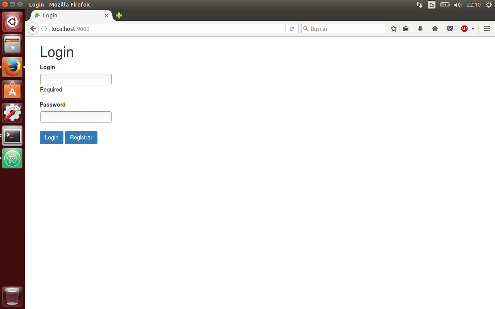

Una vez tengamos la pantalla de login delante podremos acceder al sistema de diferentes maneras. La primera de todas será como administrador. 

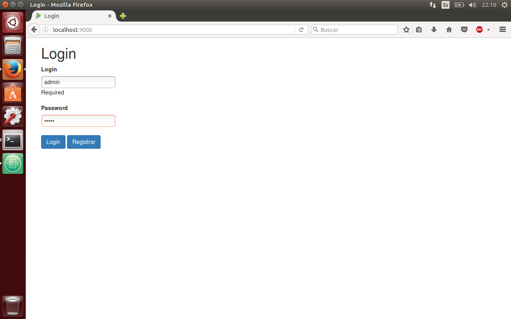

Para acceder como administrador será necesario utilizar el usuario "admin" y la contraseña "admin". Esto provocará que se nos muestre por pantalla el listado de usuarios existentes en la página web hasta el momento.

En caso de no disponer de la contraseña del administrador será necesario que nos registremos en la página, con el fin de poder tener más privilegios de los que se tienen sin ser usuario registrado o administrador del sistema.

### 1.2 Registro
Para poder acceder a la pantalla de registro podemos hacerlos de dos formas. La primera de ellas será mediante la url del registro: [Registro](http://localhost:9000/registro). Por otra parte, en la pantalla de login encontraremos un botón que nos llevará de manera directa a la pantalla de registro también. Una vez en la pantalla de registro nos encontramos con el siguiente aspecto:

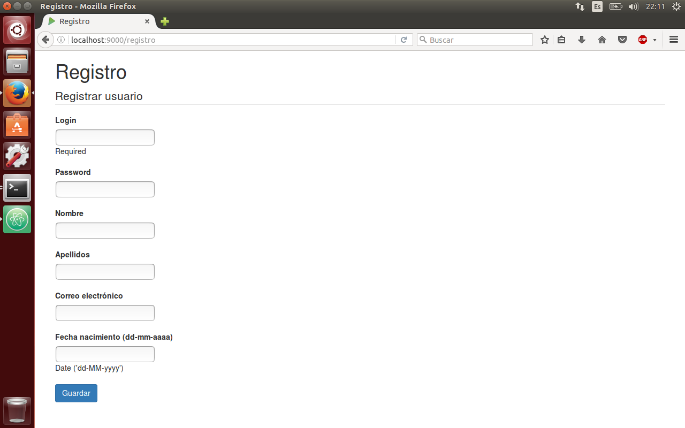

Con todos los campos rellenados de manera correcta, la web nos redigirá a la pantalla de bienvenida; lo cual será indicio de que ya somos usuarios registrados en la web. En caso contrario, por ejemplo, de que el formulario contenga algún tipo de error, la propia web nos informará del error. Los errores posibles serán vistos en próximos apartados.

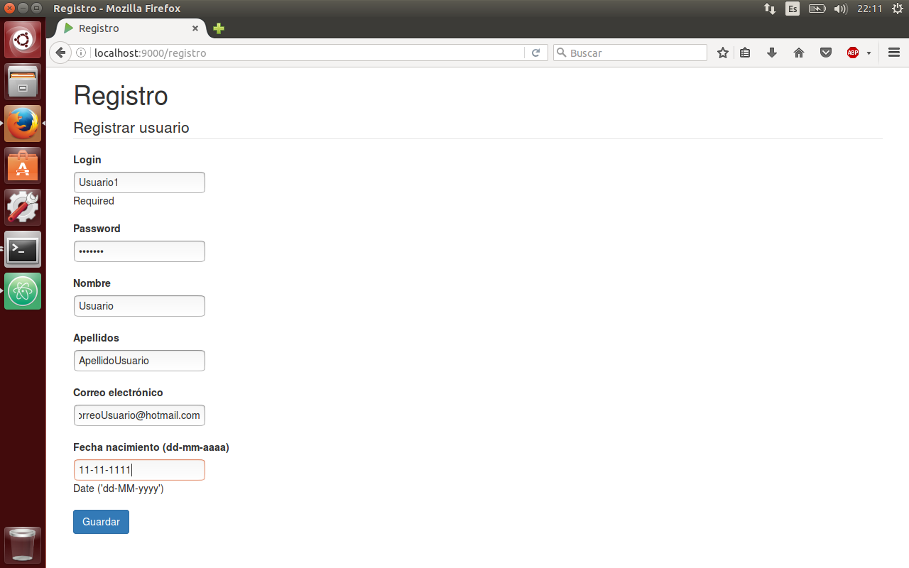

### 1.3 Pantalla de bienvenida

Con el registro realizados de manera exitosa nos encontraremos con la siguiente pantalla.

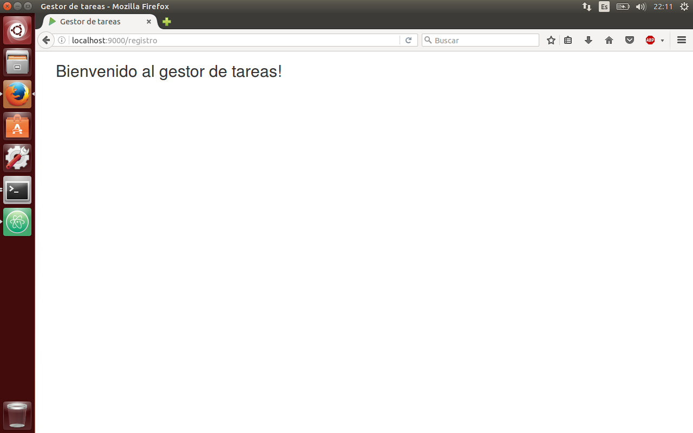

Mediante la visualización de dicha pantalla podemos decir de manera evidente que ya estamos registrados en la web!

### 1.4 Listado de usuarios

Una vez ya estemos registrados en la web podremos el listado de usuarios registrados en la página.

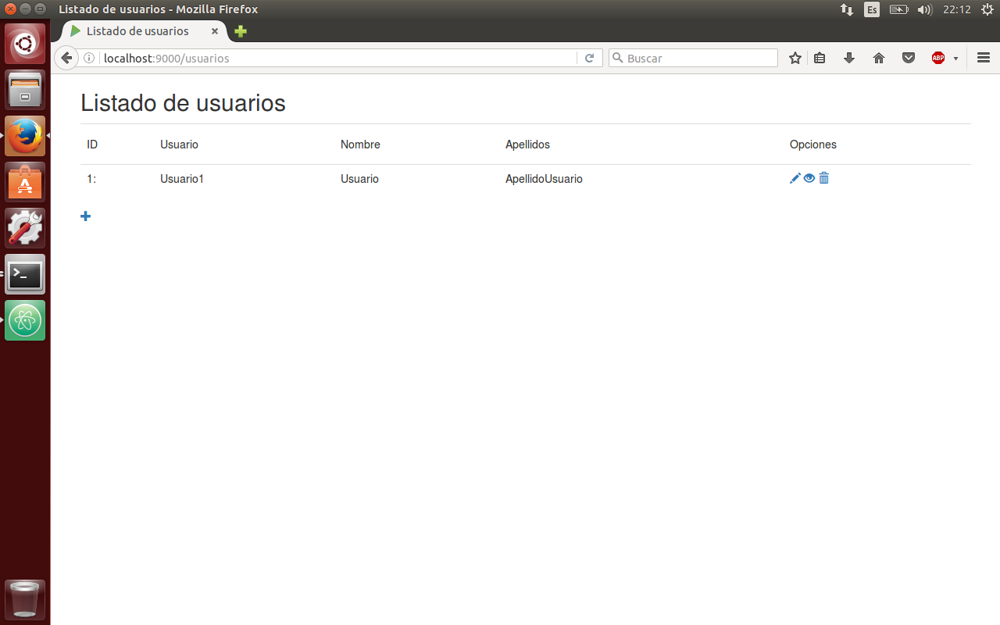

### 1.5 Modificación de usuarios

En el hipotético caso de que nuestros datos no sean correctos por cualquier circunstancia, en la página de lista de usuarios tenemos la oportunidad de modificar aquello que no es correcto mediante las opciones que nos aparecen a la derecha de cada usuario (Modificar, Detalles y Borrar). 
Pulsando en el icono de modificar nos encontraremos con la siguiente pantalla, la cual nos permitirá cambiar todos los campos erróneos.

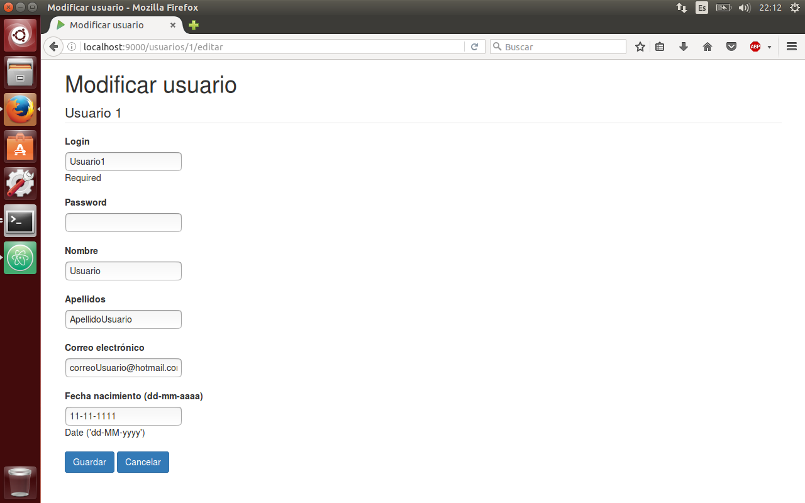

### 1.6 Detalle de usuario

Si deseamos verificar que todo está correcto, o si no sabemos con certeza si todos los campos están completos, podemos utilizar la opción de detalles de usuario. La cual tiene el siguiente aspecto:

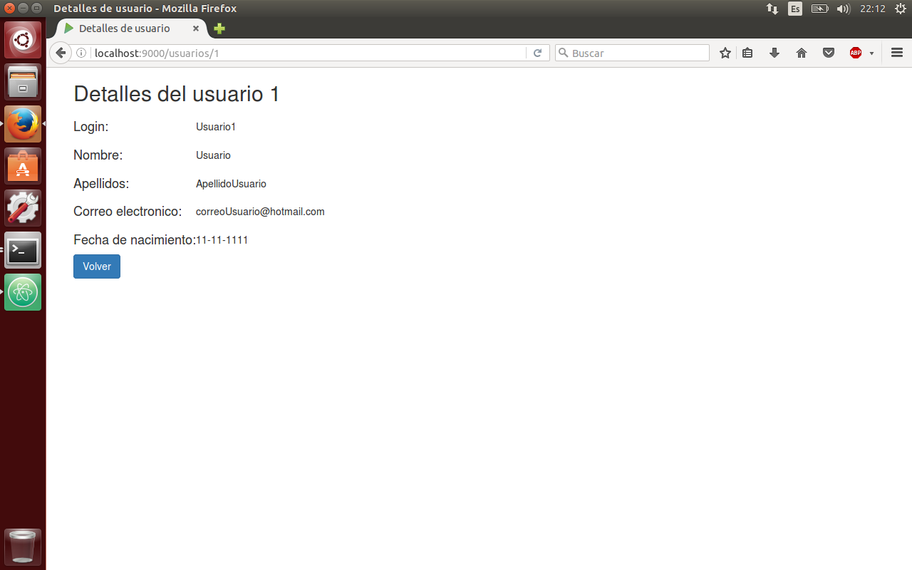

### 1.7 Borrar usuario

Por último, para finalizar con las opciones que puede realizar el usuario, tenemos la opción de borrar un usuario. Con esta opción borramos un usuario y evitamos que se pueda hacer login en la página.

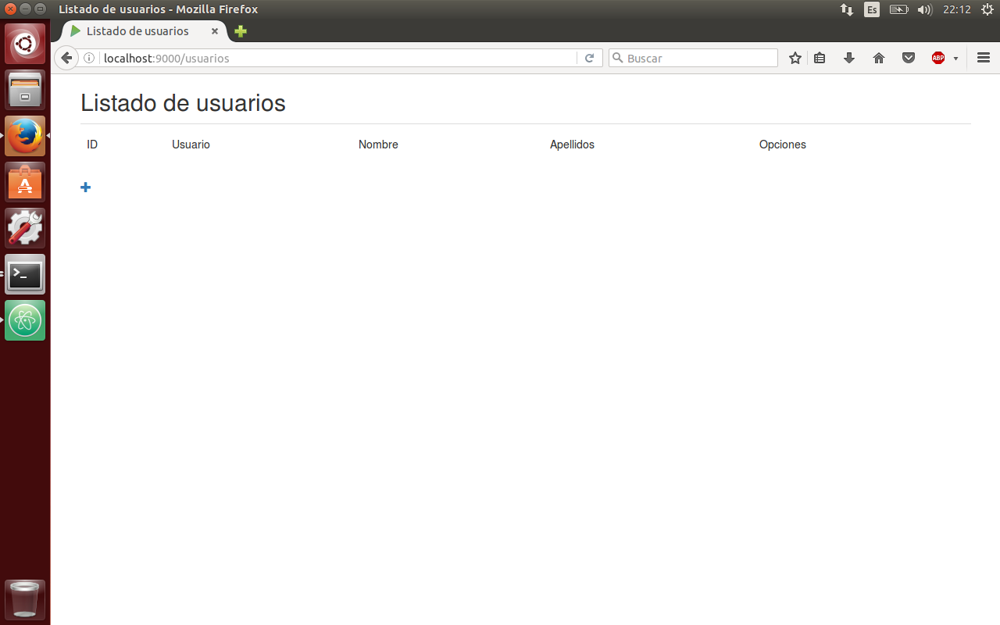

### 1.8 Crear usuario

Si después de haber borrado el usuario nos arrepentimos de haberlo echo, o si en cambio, quieres acceder a los servicios de la web; puedes registrarte mediante la siguiente pantalla:

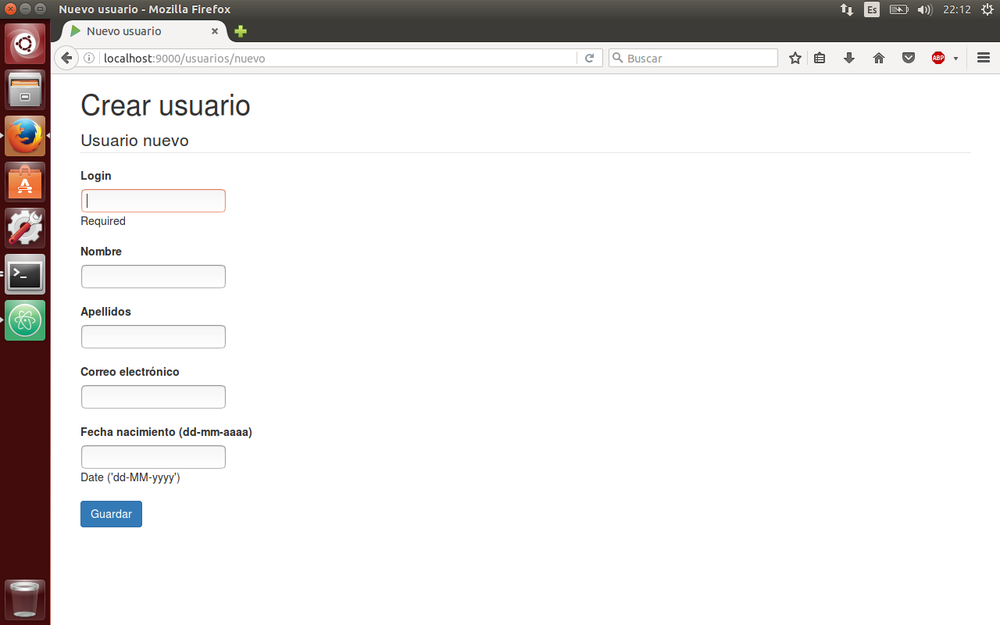

Una vez ya rellenado todo el formulario que nos permite crear un usuario, volveremos a aparecer en el listado de usuarios registrados en la página; con esta acción podremos volver a realizar todas la tareas que se han mencionado y descrito detalladamente a lo largo de todo el manual de instrucciones del usuario.

### 1.9 Mensajes del sistema

Para evitar que los datos no sean correctos, que muchos campos estén incompletos, que no se pueda acceder al sistema porque la contraseña no ha sido escrita, ..., podremos encontrar diversos mensajes que evitarán que estos fallos sucedan.

#### 1.9.1 Mensajes de campos correctos

##### 1.9.1.1 Crear usuario

El primer mensaje que podemos encontrar se produce después de haber creado un usuario de manera correcta:
   
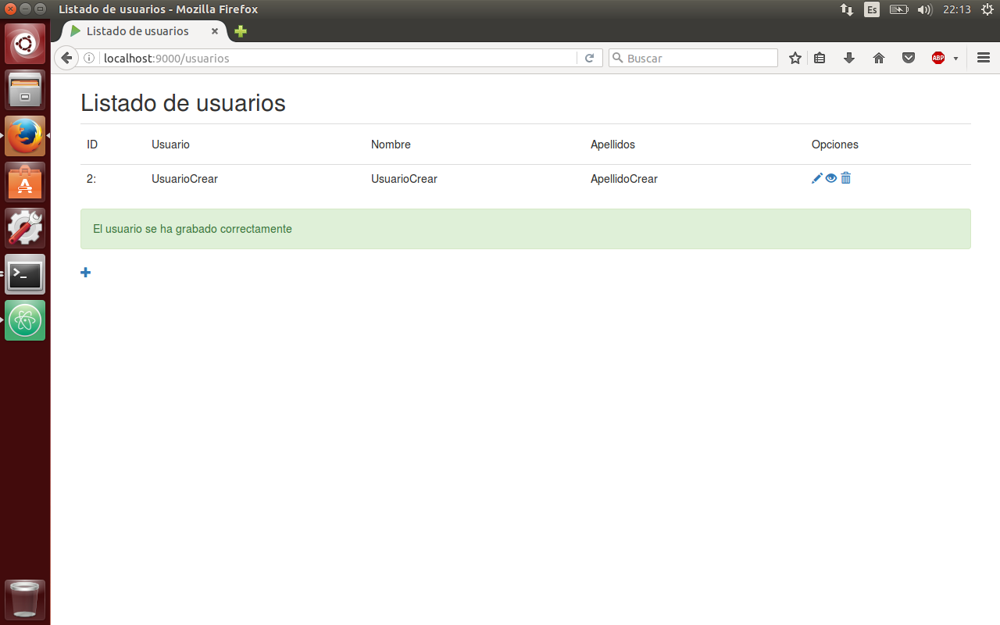

#### 1.9.2 Mensajes de error

##### 1.9.2.1 Login vacío

Por lo que hace a la parte de errores, y siguiendo el orden que tienen el manual del usuario, en el login podemos tener algún despiste. Uno de los despistes puede ser que el login esté vacío.
   
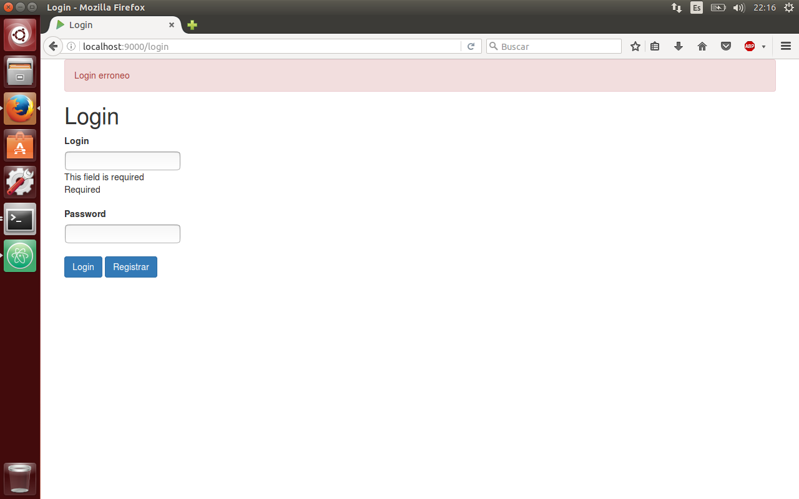

##### 1.9.2.2 Contraseña incorrecta

En caso de ingresar una contraseña incorrecta nos mostrará el siguiente mensaje por pantalla:

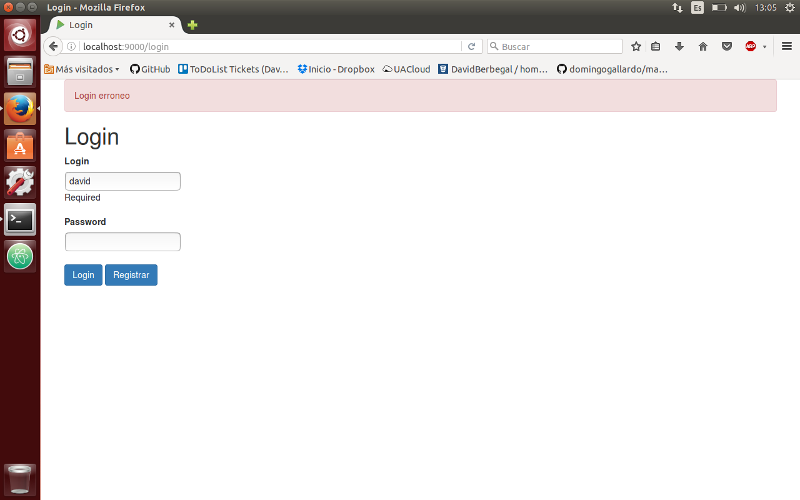

##### 1.9.2.3 Crear usuario existente

Cuando nos disponemos a crear un registrarnos en la página y el usuario ya se encuentra en la base de datos, el sistema nos mostrará una alerta para que cambiemos en campo login, y así poder registrarnos en la web.
   
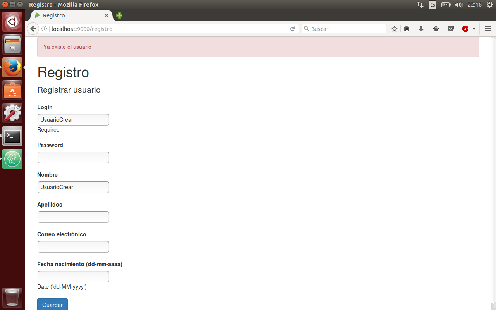
